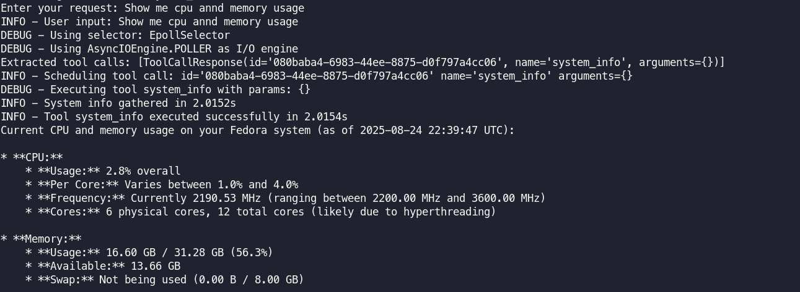

# Tool Caller Agent

A modular AI agent framework that integrates multiple tools with LLMs (OpenAI, Gemini, etc.) to process user queries, execute tool calls, and return structured responses.

---

## Project Structure

```
Project Structure


├── Makefile
├── README.md
├── requirements.txt
├── src/
│   ├── logs/
│   │   └── app.log
│   ├── tests/
│   └── tool_caller/
│       ├── cli.py
│       ├── config/
│       │   ├── __init__.py
│       │   ├── logging_config.py
│       │   └── settings.py
│       ├── core/
│       │   ├── __init__.py
│       │   ├── llm_client.py
│       │   ├── tool_executor.py
│       │   └── tool_registry.py
│       ├── __init__.py
│       ├── main.py
│       ├── models/
│       │   ├── gemini_response.py
│       │   ├── requests.py
│       │   └── responses.py
│       └── tools/
│           ├── base.py
│           ├── calculator_tool.py
│           ├── __init__.py
│           └── registry.py

```

---

### Notes:

- `src/tool_caller/` is the main framework for your tool-calling application.
- `tools/` contains implementations and a registry system that allows adding new tools easily.
- `core/` handles LLM client communication, tool execution, and registry management.
- `config/` stores settings and logging configuration.
- `models/` contains data models for API responses.
- `logs/` stores runtime logs.
- `main.py` in `src` is the entry point for the CLI application.

---

## Features & Tools

### Features

- **Tool Registry System** – Dynamically register tools with metadata (name, description, parameters).
- **LLM Integration** – Supports multiple LLM providers like OpenAI and Gemini.
- **Safe Tool Execution** – Standardized `ToolResponse` with success status, error messages, and execution time.
- **Extensible** – Easily add new tools by inheriting from `BaseTool`.
- **CLI Interface** – Supports (future) interactive and non-interactive modes.

### Available Tools

| Tool Name        | Description                                                                                     | Notes / Limitations                                                                                      |
| ---------------- | ----------------------------------------------------------------------------------------------- | -------------------------------------------------------------------------------------------------------- |
| **Calculator**   | Safely evaluates mathematical expressions using arithmetic operations and math functions.       | Simple questions like `1 + 1` may sometimes be answered directly by the LLM instead of calling the tool. |
| **Weather**      | Fetches current weather info from [OpenWeatherMap](https://openweathermap.org/) for a location. | Returns temperature, feels-like, humidity, description, and country code.                                |
| **Generic Text** | Handles general knowledge or text-based questions.                                              | Loosely prompted; very easy questions may not always trigger a tool call.                                |
| **System Info**  | Retrieves safe system details: OS, CPU count, total RAM, and disk usage.                        | Runs locally only; does **not** expose sensitive process lists or environment variables.                 |
| **Log Analysis** | Parses a log file and generates a summary report (error counts, warnings, timestamps, etc.).    | Reads from safe local log files only; does not stream live logs.                                         |

---

## Setup

1. Clone the repo

```bash
git clone <repo_url>
cd <repo_directory>
```

2. Create a `.env` file in the root directory and add your environment variables.

```bash
OPENAI_API_KEY=
WEATHER_API_KEY=
GEMINI_API_KEY=
LOG_LEVEL=INFO
```

3. **Install `uv`** (a virtual environment and task runner):

```bash
pip install uv
```

4. **Create a virtual environment and install dependencies**:

```bash
uv venv
uv run pip install -r requirements.txt
```

This will read from `requirements.txt` and install all necessary packages.

3. **Move into the source directory**:

```bash
cd src
```

---

## Running the Application

Execute the tool caller:

```bash
uv run python -m tool_caller
```

You will be prompted for a user request. The LLM will process the request and call registered tools if needed. Results and outputs will be printed in the console.

<!-- **Interactive Mode** (future support):

```bash
uv run python -m tool_caller --interactive
``` -->

---

## Adding New Tools

1. Create a new tool class inheriting from `BaseTool` in `src/tool_caller/tools/`.

2. Implement `_run` for core logic and optionally override `parameters_model`.

3. Register the tool in `tools/registry.py` with the `register_all_tools` function.

**Example**:

```python
class MyTool(BaseTool):
    @property
    def name(self) -> str:
        return "my_tool"

    @property
    def description(self) -> str:
        return "Example tool"

    @property
    def schema(self) -> ToolSchema:
        return ToolSchema(
            name=self.name,
            description=self.description,
            parameters={"type": "object", "properties": {}, "required": []}
        )

    async def _run(self, **kwargs) -> Any:
        return {"message": "Hello from MyTool!"}

    def validate_parameters(self, parameters: Dict[str, Any]) -> bool:
        """Validate input parameters"""
        return True
```

Then register in `tools/registry.py`:

```python
from .my_tool import MyTool

def register_all_tools():
    my_tool = MyTool()
    registry.register_tool(my_tool)
```

## New tools

## **1. System info Tool**

Provides comprehensive system information including CPU, memory, disk usage, and network statistics for monitoring and diagnostics.

### Usage

- **Tool Name**: `system_info`
- **Purpose**: Monitor system health and gather performance metrics
- **Categories**: CPU, Memory, Disk, Network, Processes

### Example Queries

- "What's the current system status?"
- "Show me CPU and memory usage"
- "Get system information including top processes"
- "Check disk space and network stats"



### Parameters

| Parameter           | Type    | Default | Description                                |
| ------------------- | ------- | ------- | ------------------------------------------ |
| `include_processes` | boolean | false   | Include top CPU/memory consuming processes |
| `top_processes`     | integer | 5       | Number of top processes to return          |
| `include_network`   | boolean | true    | Include network interface statistics       |

### Output

Returns a comprehensive report with:

**System Info:**

- Operating system details
- CPU cores and frequency
- System uptime
- Python version

**Performance Metrics:**

- CPU usage (overall and per core)
- Memory usage and swap statistics
- Disk usage for all mounted partitions
- Network I/O statistics (optional)

**Process Information (optional):**

- Top processes by CPU usage
- Top processes by memory usage
- Total process count

### Configuration

No configuration required - uses system APIs directly through the `psutil` library.

### Dependencies

Requires `psutil` library:

```bash
uv pip install psutil
```

## **2. Log Analysis Tool** – Analyzes log files and generates a summary report.

### Usage

- **Tool Name**: `log_analysis`
- **Purpose**: Automatically analyzes the configured application log file
- **Supported Levels**: INFO, WARNING, ERROR, DEBUG

### Example Queries

- "Analyze the application logs"
- "Show me the top 5 errors from the logs"
- "What errors have occurred recently?"

### Parameters

| Parameter | Type    | Default | Description                            |
| --------- | ------- | ------- | -------------------------------------- |
| `top_n`   | integer | 5       | Number of top error messages to return |

### Output

Returns a report with:

- Log level counts (INFO, ERROR, WARNING, DEBUG)
- Top error messages with frequency
- Time range of log entries
- Total lines processed

### Configuration

Uses the log file path from `settings.log_file` - no need to specify file paths in requests.

## Logs

Logs are saved in `src/logs/app.log` by default. Logging is enabled for tool execution, LLM requests, and errors.

---

## Testing

Run tests from `tests` using `pytest`:

```bash
uv run pytest
```

---

## Notes

- Ensure API keys for LLMs are loaded properly in `config/settings.py`.

- `ToolRegistry` ensures no duplicate tools; overwriting logs a warning.

- Currently supports OpenAI and Gemini LLM providers; other providers can be added.

---

## License

MIT License.
